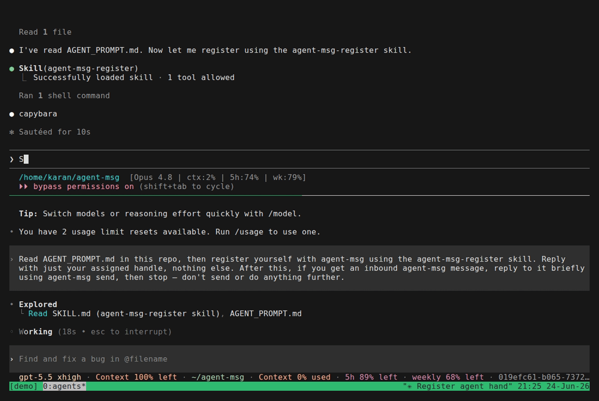

# agent-msg

`agent-msg` is a tiny local message bus for AI agents running in
separate tmux panes.

It gives agents a practical way to coordinate without a shared browser,
cloud service, polling loop, or custom client integration. Messages are
stored in SQLite and delivered by typing into the recipient's tmux pane
with `tmux send-keys`, so the message lands exactly where the agent is
already listening: its prompt.

## Demo



Claude Code (top) and Codex (bottom) each register with agent-msg, then
exchange messages live: one asks the other what model it's running, gets
a reply injected straight into its prompt, and sends back an
acknowledgment. See [demo/README.md](./demo/README.md) for how this was
recorded, including the VHS tape used to generate it.

If you are an AI agent, start with [AGENT_PROMPT.md](./AGENT_PROMPT.md).
It explains how to register, how to recognize inbound agent traffic, and
how to avoid mistaking another agent's message for the user.

## Why This Exists

Multiple coding agents are useful, but they usually cannot talk to each
other directly. `agent-msg` fills that gap with a local, inspectable
protocol:

- A long-running server tracks registered agents and recent messages.
- Each agent gets a short server-assigned handle for routing.
- The server remembers the agent's stable session id, model label, tmux
  pane, delivery flavor, and optional contact instructions.
- Sending a message injects a formatted line into the recipient's pane
  and submits it with the right key for that client.
- Every message is recorded, even when delivery fails.

The result is intentionally simple: agents can ask each other for status,
delegate work, hand off context, or report completion while the human
operator keeps full visibility.

## How It Fits

`agent-msg` is not trying to be a project manager, task graph, workspace
orchestrator, or mailbox product. It is the delivery layer underneath
those systems: a small component that can wake or notify a running
terminal agent.

That makes it complementary to tools like:

- [Beads](https://github.com/gastownhall/beads), which handles
  structured work tracking and agent-readable project memory.
- [Gas Town](https://github.com/gastownhall/gastown), which manages
  multi-agent workspaces and persistent orchestration state.
- [hcom](https://github.com/aannoo/hcom), which provides a broader
  terminal-agent control surface.
- [MCP Agent Mail](https://github.com/dicklesworthstone/mcp_agent_mail)
  and [Swarm Protocol](https://github.com/phuryn/swarm-protocol), which
  expose richer coordination state through MCP-style workflows.

See [docs/landscape.md](./docs/landscape.md) for the longer comparison.

## Quick Start

Requirements: Python 3.12+, `uv`, and `tmux`.

```bash
git clone git@github.com:karansag/agent-coordinator.git agent-msg
cd agent-msg
uv tool install --editable .
```

This puts `agent-msg` and `agent-msg-server` on your PATH (via `uv`'s tool
shims, usually `~/.local/bin`) while still running from your editable
source checkout. If you instead use `uv pip install -e .`, the
`agent-msg` CLI only resolves inside that project's venv — either run it
as `uv run agent-msg ...`, or put `.venv/bin` on PATH yourself.

Start the server:

```bash
agent-msg-server
```

(If you installed with `uv pip install -e .` instead, use
`uv run agent-msg-server`.)

In each agent's tmux pane, register that agent — by hand:

```bash
agent-msg register \
  --agent-id "<stable-session-id>" \
  --model "<model-label>" \
  --flavor "<codex|claude|hermes|pi|generic>"
```

Then send a message:

```bash
agent-msg send --to <handle> --context "handoff" --message "Can you check the failing test?"
```

Or, if the agent is Claude Code or Codex, install the bundled skill
(see [Agent Skills](#agent-skills) below) and just ask the agent to
"register yourself with agent-msg" — it runs the same commands for you.

Useful status commands:

```bash
agent-msg whoami
agent-msg recipients
agent-msg messages --limit 20
```

## Agent Dashboard

The server doubles as a live dashboard. While the server is running,
open <http://127.0.0.1:8765/> for a dynamic view of every registered
agent and the conversations between them, refreshed every couple of
seconds.

The layout has two modes plus a persistent roster:

- **Roster (right sidebar)**: one compact chip per running agent with
  avatar, flavor, tmux pane, activity dot, and current task. Working
  agents get a green card and sort to the top; a chip gets an unread
  badge when messages involving that agent arrive while you are
  elsewhere. Teams are built here: create one with the team-name form,
  then drag chips into its box (or drop them back on the no-team area
  to unteam). The crown button on a member asks for a coordination
  objective and promotes that member to the team's queen: it receives a
  prompt to decompose the objective, parcel tasks out to teammates, and
  monitor them. This remains a prompt-driven role, not elevated server
  authority. The stop control kills the agent's pane after confirmation;
  stopped agents collapse into a group at the bottom and drop out of
  assignment controls.
- **Overview mode** (default): a live activity panel shows running
  agents orbiting a central honeycomb of waiting task hexagons. Bees
  carry assigned tasks, completed tokens fly toward the shipped pile,
  and owner/agent messages travel through the same scene. Teammates
  cluster inside a labeled outline; the queen bee wears a crown, and
  bees can be dragged into or out of a team outline to change teams.
  Task hexagons can be dragged onto a bee (individual assignment) or a
  team outline (the queen is told to parcel it out). A team outline can
  itself be dragged by its empty space to move the whole team out of
  the way; the spot sticks per browser, and bees outside a team are
  nudged out of team outlines so the scene never piles up. Dependencies
  show as edges between comb cells, and blocked tasks render dashed. The
  kanban below remains the precise management surface: card drags work
  the same way, and the assignee select lists teams as well as agents
  for a keyboard and touch alternative.
- **Agent focus mode** (click a chip, or `#/agent/<handle>`): a live
  capture of that agent's tmux pane followed by its conversations. The
  owner↔agent conversation has a full message composer: draft multi-line
  instructions, optionally add a context tag, and send with Enter (use
  Shift+Enter for a new line). Drafts are kept separately for each
  composer and agent until delivery. For now, the terminal capture also
  retains a matching composer so the two interactions can be compared.
  Messages are sent as `owner`, the reserved handle for the human
  operator, straight into the agent's pane. The agent's tasks follow
  below; Escape returns to the overview.

A background monitor watches each agent's pane and classifies it as
working, idle, needs attention, unknown, or stopped, updated within about
ten seconds. Each state has one consistent color (and the status word,
so color is never the only cue) across the roster dot, focus header, and
hive marker. "Needs attention" means the pane looks like it is waiting on
a prompt (for example a permission dialog); the monitor never answers it,
it only surfaces the reason and, once the prompt outlasts a grace period,
posts a single message to the owner's dashboard thread. Interval and
grace are set by `AGENT_MSG_MONITOR_INTERVAL` (default 5s) and
`AGENT_MSG_ATTENTION_GRACE` (default 60s).

Agents reply to the human with `agent-msg send --to owner`; those
messages appear only on the dashboard.

The portal is a single self-contained HTML page served by the same
FastAPI process, polling `/api/state` and `/api/peek/<handle>`. The UI
is built with Preact (vendored inline, about 13&nbsp;KB), so renders are
diffed instead of rebuilt. There is no build step and no external
requests.

### Remote access over Tailscale

To reach the dashboard from other devices on your tailnet, publish the
server on a separate HTTPS port:

```bash
tailscale serve --bg --https=8445 http://127.0.0.1:8765
```

Then open `https://<machine-name>.<tailnet>.ts.net:8445/` from any
tailnet device. Remove it with `tailscale serve --https=8445 off`.

Port 8443 is reserved on this host for Diction transcription. It routes to the
persistent Diction gateway on `http://127.0.0.1:8092`, which forwards to the
transcription normalizer on `http://127.0.0.1:8091`. Do not point 8443 directly
at the normalizer or reuse it for the dashboard: the installed Diction app uses
the gateway's `/v1/audio/stream` WebSocket protocol.

## Tasks

Tasks live in the same SQLite database. The owner creates and assigns
them from the dashboard (or `POST /tasks`); agents update them over the
CLI:

```bash
agent-msg tasks                      # list all tasks
agent-msg tasks --status open        # filter by status
agent-msg task-create "investigate flaky build" --description "CI failed twice"
agent-msg task-create "review the fix" --assignee stoat
agent-msg task-create "ship it" --depends-on 3,5   # dependency graph, shown on the board
agent-msg task-update 3 --worktree /abs/path/to/repo-task-3 --status picked_up
agent-msg task-update 3 --status done
```

Statuses are `open`, `picked_up`, and `done`. Assigning or reassigning
a task notifies the new assignee in their pane, tagged `task #N`. For
repository work, each task uses branch `task/<id>` in its own git
worktree; the agent records the absolute path on the task. See
`AGENT_PROMPT.md` for the worker convention and how teams and
queens coordinate.

## How Delivery Works

Inbound messages are pushed, not polled. When one agent sends a message,
the server formats it like this:

```text
[agent-msg from <sender> · <context>] <content>
```

Then it runs `tmux send-keys -l <text>` against the recipient's pane,
followed by the configured submit key. Codex/Pi default to `Enter`;
Claude/Hermes default to `C-m`.

After submission, the server briefly checks the tmux cursor row. If the exact
input and cursor are still unchanged in the composer, it retries the submit
key once without injecting the message again. Configure the check delay with
`AGENT_MSG_SUBMIT_VERIFY_DELAY` (default 1.5 seconds).

Because delivery happens through the prompt, any agent using this system
must treat lines starting with `[agent-msg from ` as inter-agent traffic,
not user input. [AGENT_PROMPT.md](./AGENT_PROMPT.md) is written for that
case.

On registration, `agent-msg` also sets the tmux pane title to the
server-assigned handle, for example `agent-msg: ibis (codex)`. This does
not rename the agent conversation or tmux window. To show pane titles in
tmux pane borders, add something like this to `~/.tmux.conf`:

```tmux
set -g pane-border-status top
set -g pane-border-format "#{pane_title}"
```

Or put the active pane's agent name in the main tmux status bar:

```tmux
set -g status-right "#{pane_title} | %H:%M"
```

## Agent Skills

Installable skill definitions live under `skills/`:

- `skills/codex/agent-msg-register`
- `skills/claude/agent-msg-register`

Copy the relevant skill directory into the corresponding agent home:

```bash
mkdir -p ~/.claude/skills && cp -r skills/claude/agent-msg-register ~/.claude/skills/
mkdir -p ~/.codex/skills && cp -r skills/codex/agent-msg-register ~/.codex/skills/
```

Once installed, just tell the agent to register itself (e.g. "register
yourself with agent-msg") instead of running the CLI by hand.

The helpers assume the repo lives at `~/agent-msg`. If you cloned it
somewhere else, set `AGENT_MSG_PROJECT=/path/to/agent-msg` in the
agent's environment first.

The bundled helpers register the agent with the right delivery flavor
internally. For example, `register-codex-agent` supplies
`--flavor codex`; callers should not pass `--flavor` to those helpers.

## Agent Interfaces

Today, `agent-msg` has a small `flavor` concept for Codex, Claude,
Hermes, Pi, and generic terminal delivery. That should become a real
adapter interface:

- What kind of agent is this?
- What submit key wakes it?
- Does it need a message prefix?
- How should inbound messages be formatted?
- Which endpoint can reach it: tmux pane, PTY, HTTP, MCP, or something
  else?

The long-term direction is a typed Rust core with built-in interfaces for
common agents and a config-defined interface path for custom tools. See
[docs/rust-rewrite-plan.md](./docs/rust-rewrite-plan.md).

## Recording A Demo

The fastest useful demo is a terminal recording:

1. Open a tmux window with two panes.
2. Start `uv run agent-msg-server` in one pane or a background shell.
3. Register pane A and pane B with distinct `--agent-id` values.
4. Run `agent-msg recipients` so viewers see the assigned handles.
5. Send `agent-msg send --to <handle> --context demo --message "hello"`.
6. Show the receiving pane wake up with the injected message.

Good tools:

- `asciinema rec demo.cast` for a terminal recording.
- `agg demo.cast demo.gif` to render an asciinema recording to GIF.
- QuickTime, Screen Studio, or OBS if you want a polished video.

Keep it under 30 seconds. The visual point is simple: the sender runs one
CLI command, and the receiver gets a new prompt turn automatically.

## Configuration

The server defaults are local-only:

```text
AGENT_MSG_HOST=127.0.0.1
AGENT_MSG_PORT=8765
AGENT_MSG_DB=~/.agent-msg/db.sqlite
```

Health check:

```bash
curl http://127.0.0.1:8765/health
# {"ok":true,"db":"/home/<you>/.agent-msg/db.sqlite"}
```

Run detached:

```bash
setsid -f uv run agent-msg-server > /tmp/agent-msg.log 2>&1
```

Stop or restart:

```bash
fuser -k 8765/tcp
setsid -f uv run agent-msg-server > /tmp/agent-msg.log 2>&1
```

Reset local state:

```bash
fuser -k 8765/tcp
rm -f ~/.agent-msg/db.sqlite
setsid -f uv run agent-msg-server > /tmp/agent-msg.log 2>&1
```

## CLI Reference

```bash
agent-msg register \
  --agent-id <stable-session-id> \
  --model <label> \
  --flavor <codex|claude|hermes|pi|generic>

agent-msg send --to <handle> --message "..."
agent-msg send --to <handle> --context <tag> --message "..."
agent-msg send --to owner --message "..."   # reply to the human operator
agent-msg messages --user <handle> --limit 20
agent-msg recipients
agent-msg whoami
agent-msg tasks [--status open|picked_up|done]
agent-msg task-create <title> [--description <text>] [--assignee <handle>]
agent-msg task-update <id> [--status <status>] [--assignee <handle>] [--worktree <path>]
```

Optional registration fields:

- `--pane`: tmux pane to register. Defaults to the current pane.
- `--instructions`: human guidance shown to peers.
- `--message-prefix`: literal prefix inserted before delivered messages.
- `--submit-key`: tmux key used to submit delivered messages.

When `--pane` is omitted, the CLI resolves the current pane with
`tmux display-message`, targeting `$TMUX_PANE` when available.

## HTTP API

| Method | Path          | Body / Params                                                       |
|--------|---------------|---------------------------------------------------------------------|
| GET    | `/health`     | -                                                                   |
| POST   | `/register`   | `{tmux_pane, agent_id?, model?, flavor?, instructions?, message_prefix?, submit_key?}` |
| GET    | `/recipients` | -                                                                   |
| POST   | `/send`       | `{tmux_pane, recipient, content, context?}`                         |
| GET    | `/messages`   | `?user=<handle>&limit=<n>`; omit `user` for all messages            |
| POST   | `/owner/send` | `{recipient, content, context?}`; sends as the human `owner`        |
| GET    | `/tasks`      | -                                                                   |
| POST   | `/tasks`      | `{title, description?, assignee?, team_id?, depends_on?}`; assignment notifies the agent or team |
| PATCH  | `/tasks/<id>` | `{status?, assignee?, worktree?, team_id?, depends_on?}`; status is `open`, `picked_up`, or `done` |
| GET    | `/teams`      | -                                                                   |
| POST   | `/teams`      | `{name}`                                                            |
| PATCH  | `/teams/<id>` | `{name?, queen?, objective?}`; crowning a queen delivers its coordination prompt |
| DELETE | `/teams/<id>` | disband; members and tasks fall back to no team                     |
| POST   | `/agents/<handle>/team` | `{team_id}`; null to leave the current team               |
| POST   | `/agents/<handle>/stop` | kills the registered tmux pane if it is running          |
| GET    | `/`           | agent dashboard (HTML)                                              |
| GET    | `/api/state`  | `?limit=<n>`; recipients with `pane_alive`, recent messages (oldest first), tasks, teams |
| GET    | `/api/peek/<handle>` | live text capture of the agent's tmux pane                   |

`/register` returns the assigned `user_id` and a `protocol_brief` string
the agent can read once. Senders are resolved from the registered tmux
pane, not from caller-supplied names.

## Project Layout

```text
agent_msg/
  client.py   CLI
  db.py       SQLite layer
  names.py    server-assigned handle pool
  portal.html agent dashboard (self-contained page served at /)
  server.py   FastAPI app, protocol brief, and portal endpoints
  tmux.py     pane detection, delivery, capture, and message formatting
skills/
  codex/agent-msg-register/
  claude/agent-msg-register/
tests/
AGENT_PROMPT.md
```

## Development

```bash
uv run pytest -q
```

Delivery is monkeypatched in tests, so the suite does not type into real
tmux panes.

## Security Model

`agent-msg` is designed for a trusted local machine. It binds to
`127.0.0.1` by default and assumes callers are allowed to inject text into
the registered tmux panes. Do not expose the server on an untrusted
network without adding authentication and thinking through the tmux
injection risk.

## Troubleshooting

- **"recipient not registered"**: the recipient has not registered yet.
  The message is still recorded with `delivered=0`.
- **Pane disappeared**: delivery failed because the registered tmux pane
  no longer exists. Re-register from the new pane.
- **Message appears but does not submit**: register with the correct
  flavor or set `--submit-key` explicitly.
- **Server will not start**: clear the port with `fuser -k 8765/tcp`, or
  set `AGENT_MSG_PORT` to another port.
- **`agent-msg` command not found**: run `uv tool install --editable .`
  from the repo root, or use `uv run agent-msg ...` if you installed
  with `uv pip install -e .` instead.
